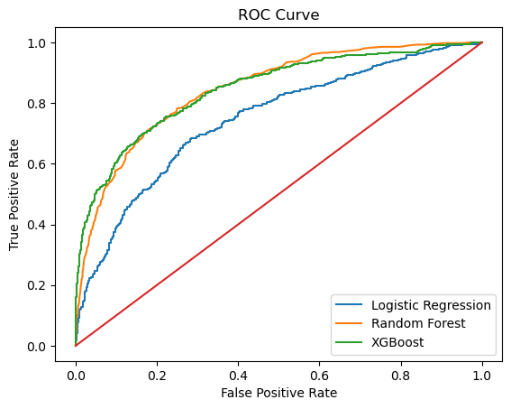
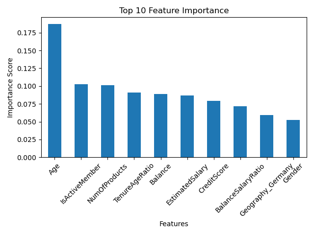
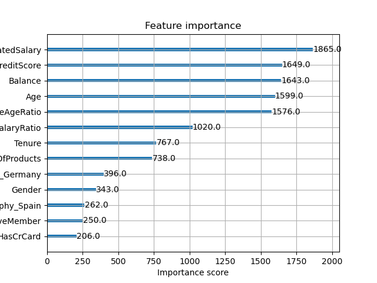
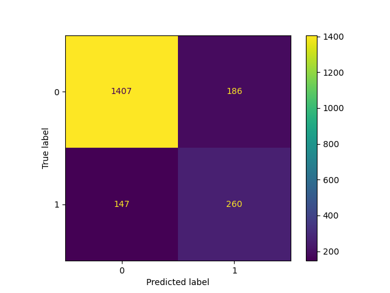

# Bank Customer Churn Prediction with Machine Learning & FastAPI

## Project Overview

Customer churn is a major challenge in the banking industry. Retaining customers is significantly more cost-effective than acquiring new ones. This project develops a machine learning pipeline to predict whether a bank customer is likely to churn, enabling proactive retention strategies.

This project includes:

- End-to-end machine learning workflow
- Feature engineering
- Class imbalance handling
- Hyperparameter tuning
- Model comparison
- Model deployment using FastAPI
- Business-driven recommendations

--------------------------------------

## Business Problem

Banks lose revenue when customers leave (churn). By predicting churn risk early, banks can:

- Offer personalized retention strategies
- Improve customer satisfaction
- Reduce revenue loss
- Optimize marketing costs

This model identifies customers at high churn risk and estimates churn probability.

--------------------------------------

## Dataset Description

The dataset contains customer information including demographics, account activity, and financial behavior.

### Features:

- CreditScore — Customer credit score
- Geography — Country of residence
- Gender — Male/Female
- Age — Customer age
- Tenure — Years with bank
- Balance — Account balance
- NumOfProducts — Number of bank products used
- HasCrCard — Credit card ownership
- IsActiveMember — Activity status
- EstimatedSalary — Estimated annual salary

### Target Variable:

- Exited — 1 = Customer churned, 0 = Retained

--------------------------------------
## Machine Learning Workflow

### 1. Data Preprocessing

Purpose:

Prepare raw data for modeling.

Steps:

- Handling missing values
- Encoding categorical variables
- Feature scaling (if used)
- Train-test split

Benefit:

Ensures models receive structured, machine-readable data.

--------------------------------------

### 2. Feature Engineering

Purpose:

Create new meaningful features to improve predictive power.

Engineered Features:

- BalanceSalaryRatio
- TenureAgeRatio

Benefit:

Enhances model performance and interpretability.

--------------------------------------

### 3. Class Imbalance Handling

Technique Used:

- SMOTE (Synthetic Minority Oversampling Technique)

Purpose:

Balance churn vs non-churn classes.

Benefit:

Improves recall for churn predictions.

--------------------------------------

### 4. Model Training

Models Used:

- Logistic Regression
- Random Forest
- XGBoost (Best Performing)

Purpose:

Compare different algorithms to identify the most accurate model.

--------------------------------------

### 5. Hyperparameter Tuning

Technique:

- GridSearchCV

Purpose:

Optimize model parameters for best performance.

Benefit:

Improves prediction accuracy and generalization.

--------------------------------------

### 6. Model Evaluation

Metrics Used:

- Accuracy
- Precision
- Recall
- F1 Score
- ROC-AUC Score

ROC-AUC was used as the primary evaluation metric.

Why ROC-AUC?

Because churn prediction is an imbalanced classification problem.

### ROC Curve Analysis

Receiver Operating Characteristic (ROC) curve is used to evaluate the classification performance of the churn prediction model across different thresholds.

The ROC curve plots:

- True Positive Rate (Recall)
- False Positive Rate

A higher Area Under Curve (AUC) indicates better model performance.

### ROC Curve – XGBoost Model



### Interpretation

- The curve stays significantly above the diagonal line.
- This indicates the model performs better than random guessing.
- The model demonstrates strong ability to distinguish between churned and retained customers.

Business Impact:

A high ROC-AUC score ensures reliable identification of customers likely to churn, enabling early intervention strategies.

### Feature Importance 





### Confusion Matrix 

--------------------------------------

### Business Recommendations Based on Model insights:

1. Target High-Risk Customers
   Customers with:
    Low tenure
    Low product usage
    Inactive accounts
  should receive retention offers.

2. Improve Customer Engagement
   Inactive members show higher churn probability.
   Recommended actions:
    Personalized marketing
    Loyalty rewards

3. Promote Multi-Product Usage
   Customers using more products churn less.
   Recommended actions:
    Cross-selling strategies
    Product bundling

4. Monitor High Balance Customers
   High-balance churners represent major financial risk.
   Recommended actions:
    Dedicated customer support
    VIP services

--------------------------------------

### Technologies Used:
 Python
 Pandas
 NumPy
 Scikit-learn
 XGBoost
 SMOTE
 FastAPI
 Uvicorn
 Matplotlib
 Seaborn

--------------------------------------

### Key Results:
 Both Randon Forest and XGBoost models achieved highest ROC-AUC
 Improved churn detection performance
 Enabled real-time predictions using API

--------------------------------------

### Future Improvements:
 Add SHAP model interpretability
 Deploy to cloud (AWS / Azure)
 Build interactive dashboard
 Automate retraining pipeline

 ### 7. Model Deployment

The final XGBoost model was deployed using:

- FastAPI
- Uvicorn server

This enables real-time predictions through API calls.

--------------------------------------

### API Usage

Run API:

```bash
uvicorn app.main:app --reload

Open Swagger UI:
http://127.0.0.1:8000/docs

Example Prediction Input:
{
 "CreditScore": 580,
 "Geography": "Germany",
 "Gender": "Female",
 "Age": 45,
 "Tenure": 1,
 "Balance": 85000,
 "NumOfProducts": 1,
 "HasCrCard": 1,
 "IsActiveMember": 0,
 "EstimatedSalary": 40000
}

Example Output:
{
 "churn_prediction": 1,
 "churn_probability": 0.90
}

--------------------------------------
